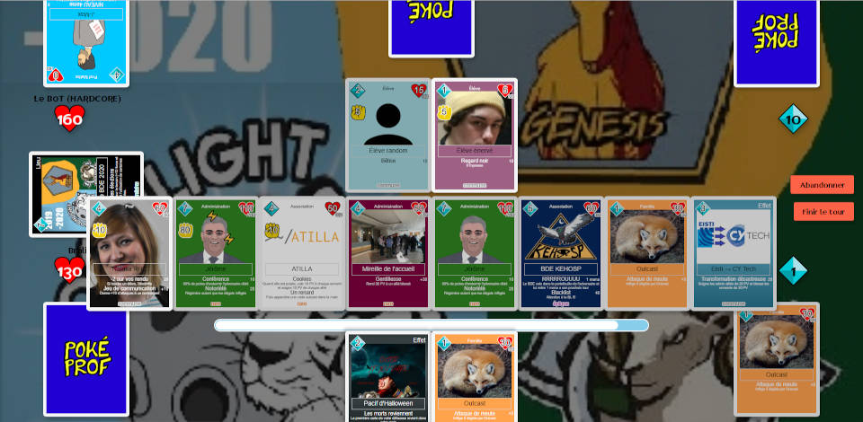

# Poképrof

Poképrof est un jeu de cartes en ligne, les utilisateurs peuvent créer des cartes, jouer avec etc



La version Poképrof de l'EISTI (ex CY Tech) est actuellement à cette URL : [ambi.dev/pokeprof](https://ambi.dev/pokeprof). (BDD MariaDB, PHP 8.2)
La branche master y est auto-déployer à chaque push.


## Lancer en local

Il est possible de lancer le projet en local.
 - cloner le projet
 - si besoin : `chmod -R 777 src/cached src/assets/cards src/assets/boosters`
 - recommandé : faire en sorte que [src/api/onceaday.php](src/api/onceaday.php) s'exécute une fois par jour


### Puis sans Docker

> Pour cela il faut faudra PHP et MySQL (ou MariaDB).

 - créer un fichier credentials.php dans le dossier src/api contenant identifiants de la base de données, sous cette forme :
```php
<?php
define('DB_HOSTNAME', 'localhost');
define('DB_USER', 'user');
define('DB_PASSWORD', 'password123');
define('DB_NAME', 'pokeprof');
define('PORTAL_CONNECT_URL', 'http://localhost/connect.php?app=pokeprof&params=');
define('PORTAL_AVATAR_URL', 'http://localhost/avatar.php?id=');
define('PORTAL_USER_URL', 'http://localhost/api/user.php?token=');
// Les lignes suivantes sont optionnelles
define('POKEPROF_WEBHOOK_CARD_CREATE', null);
define('POKEPROF_WEBHOOK_CARD_EDIT', null);
define('POKEPROF_WEBHOOK_ERROR', null);
?>
```
 - exécuter dans la base de données le script SQL [init.sql](init.sql)
 - lancer le serveur php dans le dossier src


### Ou avec Docker

> Pour cela il faudra Docker et Docker Compose.

 - définir les variables d'environnement `PORTAL_CONNECT_URL`, `PORTAL_AVATAR_URL` et `PORTAL_USER_URL`, cela peut se faire dans un fichier `.env` à la racine du projet
 - optionnel : définir les variables d'environnement `POKEPROF_ASSETS_PATH`, `POKEPROF_WEBHOOK_CARD_CREATE`, `POKEPROF_WEBHOOK_CARD_EDIT` et `POKEPROF_WEBHOOK_ERROR`
 - exécuter `docker-compose up` dans le dossier racine du projet


## Administration

Le jeu n'est pas autonome, il nécessite une intervention humaine pour être jouable. Notamment pour la modération des cartes et la création des scripts.

Des explications sur la création des scripts sont disponibles dans [scripts.md](scripts.md).